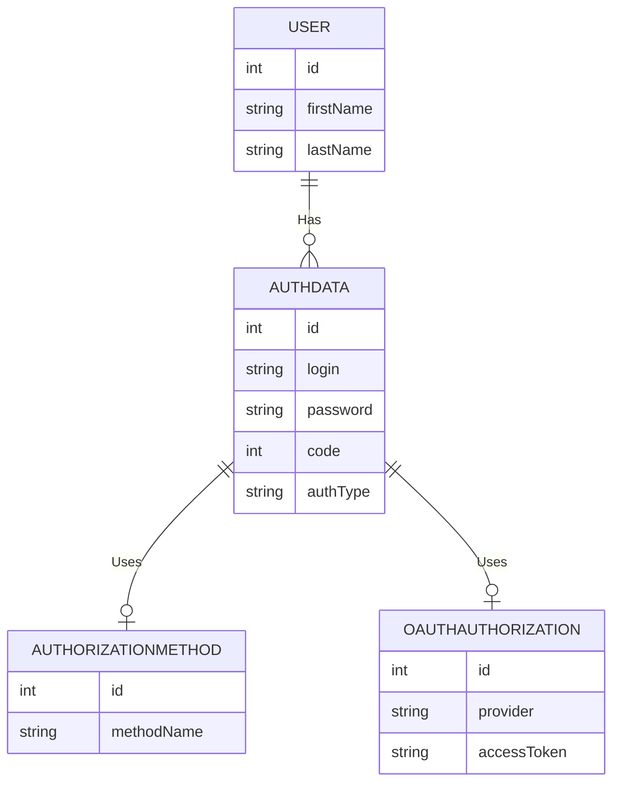
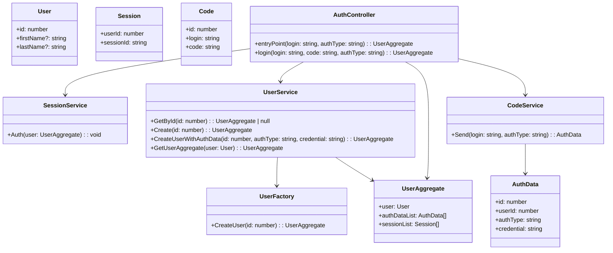
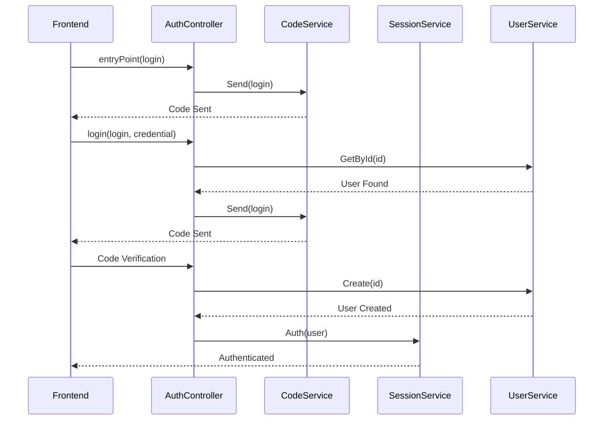

### Тестовое задание на проектирование.
Требуется описать сервис авторизации с разными типами входных данных.
Данный сервис реализует поиск пользователей, проверку авторизационных данных, вызов методов создания и получения данных пользователя. 

[Полный текст задания](https://docs.google.com/document/d/1AB2b8yiZ3sNgbkdMpDuEq2hr2H4xuQIRabNuO6oOlOY/) 

#### Выполнение:

1. Диаграмма таблиц баз данных

Для создания и описания структуры базы данных, включая таблицы и их взаимосвязи, используется ER-диаграмма (зд. - нотация Мартина): 

Сущность USER связана с AUTHDATA отношением "Has", что указывает, что пользователь может иметь несколько записей в AUTHDATA.
AUTHDATA связана с AUTHORIZATIONMETHOD и OAUTHAUTHORIZATION отношениями "Uses", указывающими на использование этих методов авторизации.

2. UML-диаграмма классов

В данной диаграммеп к основным связям добавлены дополнительные:
`CodeService --> AuthData`: Связь между `CodeService` и `AuthData`.
`UserService --> UserAggregate`: Связь между `UserService` и `UserAggregate`.
`AuthController --> UserAggregate`: Связь между `AuthController` и `UserAggregate`.

Данные связи не являются обязательными, и добавлены исключительно для примера, т.к. конкретное количество связей будет зависеть от потребностей проекта, а слишком много связей могут излишне усложнять систему. 
К примеру, в данной диаграмме отсутствует связь `User --|> Session`, потому что здесь сессии ассоциированы с пользователями через `UserAggregate`, который уже включает в себя пользователя и его сессии, и эта связь не является необходимой.

3. UML-диаграмма последовательности (стек вызова методов). 
Отражает последовательность действий при входе и аутентификации пользователя, включая отправку кода, проверку и создание пользователя, а также процесс аутентификации через сессии.

> В файле README.md использован язык описания диаграмм [Mermaid](https://mermaid.js.org/).
