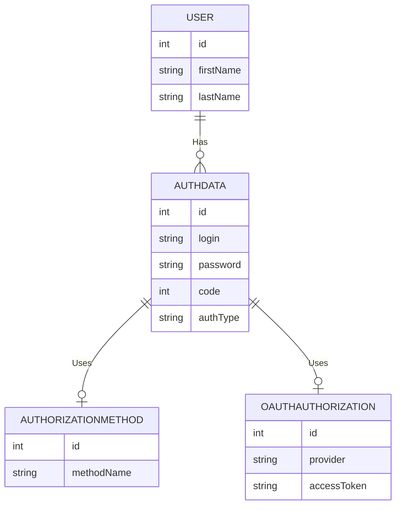

# diagrams-authorization-service
Тестовое задание на проектирование

```mermaid
erDiagram
  USER {
    int id
    string firstName
    string lastName
  }
  AUTHDATA {
    int id
    string login
    string password
    int code
    string authType
  }
  AUTHORIZATIONMETHOD {
    int id
    string methodName
  }
  OAUTHAUTHORIZATION {
    int id
    string provider
    string accessToken
  }
  USER ||--o{ AUTHDATA : "Has"
  AUTHDATA ||--o| AUTHORIZATIONMETHOD : "Uses"
  AUTHDATA ||--o| OAUTHAUTHORIZATION : "Uses"
```
